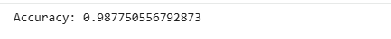

# Fake News Detection Using Machine Learning

## Project Overview
Automatically classify news articles as real or fake using NLP and machine learning.

## Dataset
- Source: [Kaggle Fake and Real News Dataset](https://www.kaggle.com/datasets/clmentbisaillon/fake-and-real-news-dataset)
- Columns: title, text, label (0 = Real, 1 = Fake)

## Day 1 – Data Exploration
- Loaded Fake and True news datasets
- Combined into one dataset with labels
- Explored dataset structure and missing values
- Visualized class distribution
- Created combined 'content' column

## Day 2 – Text Preprocessing
- Converted text to lowercase
- Removed punctuation, numbers, and extra spaces
- Removed common English stopwords
- Created cleaned text column 'content_clean' for ML

## Day 3 – Feature Extraction & Model Training
- Converted text into numerical features using TF-IDF
- Split dataset into train and test sets
- Trained Logistic Regression classifier
- Evaluated model (accuracy and classification report)
- Results saved in `results/` folder

## Day 3 Results

- **Accuracy:**  
  

- **Classification Report:**  
  
